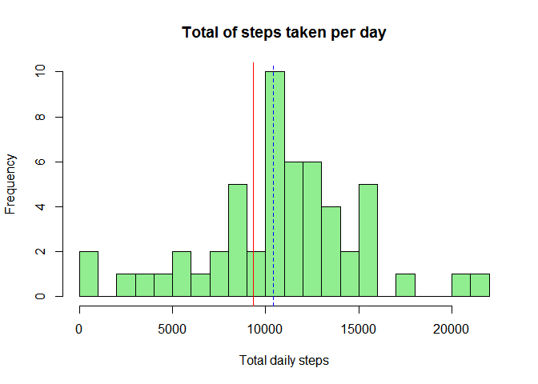
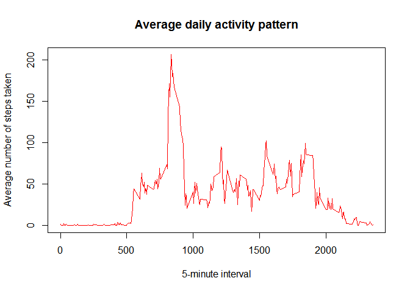
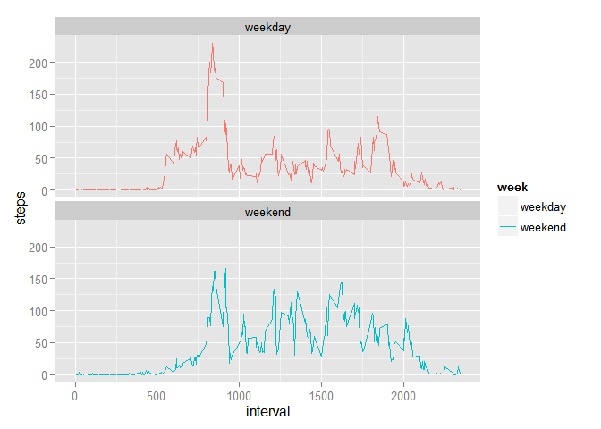

```r
require('knitr')
```

```
## Loading required package: knitr
```

```r
require(plyr)
```

```
## Loading required package: plyr
```
# Reproducible Research: Peer Assessment 1 
### Author: Salvatore Lenza
#### Rome sep 20th, 2015 

## Loading and preprocessing the data

```r
if(!file.exists('activity.csv')){
    unzip('activity.zip')
}
data <- read.csv("activity.csv", header=TRUE)
clean_data <- data[which(data$steps != "NA"), ]
```
## What is mean total number of steps taken per day?

```r
library(ggplot2)
hist(tapply(data$steps, data$date, sum), xlab = "Total daily steps", breaks = 20, 
    main = "Total of steps taken per day", col="light green")
total.steps <- tapply(data$steps, data$date, FUN=sum, na.rm=TRUE)

# mean and median total number of steps taken per day
mean.spd<-mean(total.steps, na.rm=TRUE)
median.spd<-median(total.steps, na.rm=TRUE)
abline(v=mean.spd, col = c("red"))
abline(v=median.spd, col = c("blue"), lty = 2)
```

 

## What is the average daily activity pattern?

```r
average_by_interval <- ddply(clean_data, .(interval), summarise, steps=mean(steps))
plot(average_by_interval$interval, average_by_interval$steps, type="l", 
     col="red",
     xlab="5-minute interval", 
     ylab="Average number of steps taken",
     main="Average daily activity pattern")
```

 

```r
# Which 5-minute interval, on average across all the days in the dataset, contains the maximum number of steps?
average_by_interval[average_by_interval$steps==max(average_by_interval$steps),]
```

```
##     interval    steps
## 104      835 206.1698
```

```r
colnames(average_by_interval)[2] <- "intervalAvg"
```
## Imputing missing values

```r
# Total number of missing values in the dataset
sum(is.na(data$steps))
```

```
## [1] 2304
```

```r
# Fill NA's with average for that 5-min interval
merged <- arrange(join(data, average_by_interval), interval)
```

```
## Joining by: interval
```

```r
# Create a new dataset that is equal to the original dataset but with the missing data filled in.
merged$steps[is.na(merged$steps)] <- merged$intervalAvg[is.na(merged$steps)]
# Histogram
new_total_by_day <- ddply(merged, .(date), summarise, steps=sum(steps))
hist(new_total_by_day$steps, main="Number of Steps", 
     xlab="Total number of steps taken each day", col="light green",)
# mean and median total number of steps taken per day
mean.spd1<-mean(new_total_by_day$steps)
median.spd1<-median(new_total_by_day$steps)
abline(v=mean.spd1, col = c("red"))
abline(v=median.spd1, col = c("blue"), lty = 2)
```

 

```r
total_clean_data <- sum(clean_data$steps)
total_merged_data <- sum(merged$steps)
delta <- total_merged_data -total_clean_data []
```
Mean values didn't change. Filling values added total of  8.6129509\times 10^{4}  steps.

## Are there differences in activity patterns between weekdays and weekends?

```r
Data1 <- merged
Data1$day <- weekdays(as.Date(merged$date))
attach(Data1)
d <- levels(factor(day))

Data1[day==d[1],5]<-"weekend"
Data1[day==d[6],5]<-"weekend"
Data1[day==d[2],5]<-"weekday"
Data1[day==d[3],5]<-"weekday"
Data1[day==d[4],5]<-"weekday"
Data1[day==d[5],5]<-"weekday"
Data1[day==d[7],5]<-"weekday"

Data1$week <- as.factor(Data1$day)

spiw <- ddply(Data1, .(interval,week), summarize, steps = mean(steps, na.rm=TRUE))
max.spiw <- max(spiw$steps)
max.intw <- spiw[spiw$steps==max(max.spiw),1]
library(ggplot2)
ggplot(data=spiw, aes(x=interval, y=steps, group=week)) + geom_line(aes(color=week))+ facet_wrap(~ week, nrow=2)
```

 

